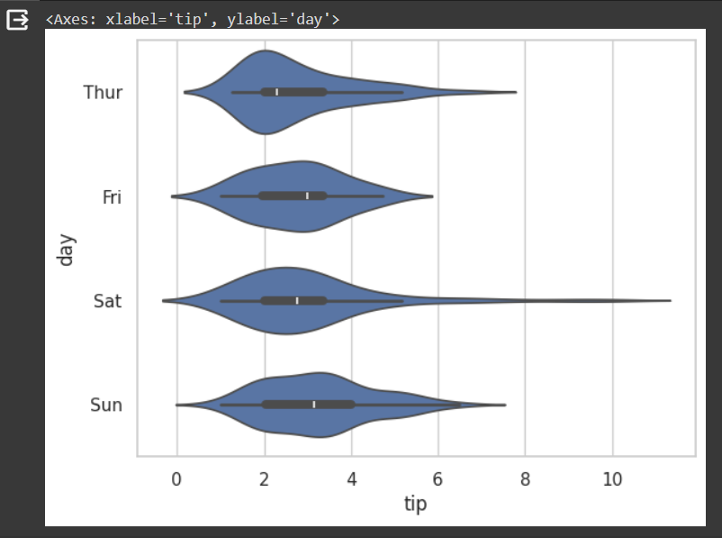
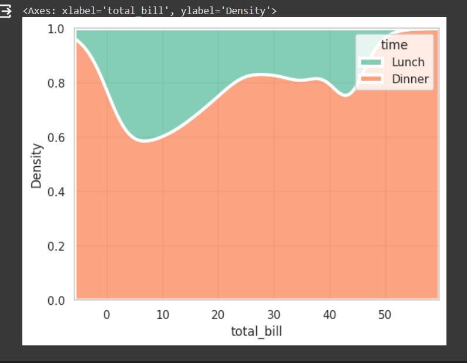
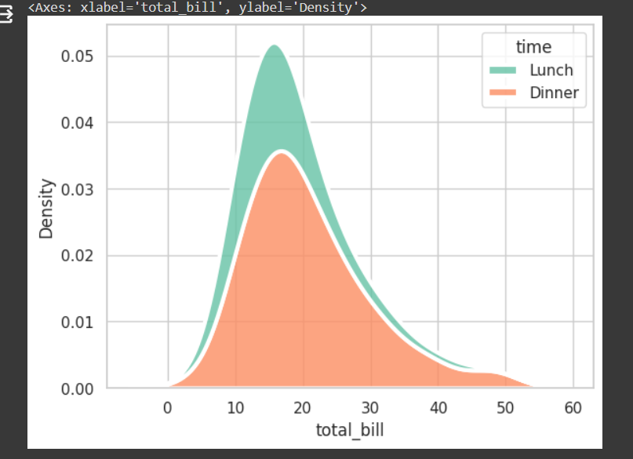
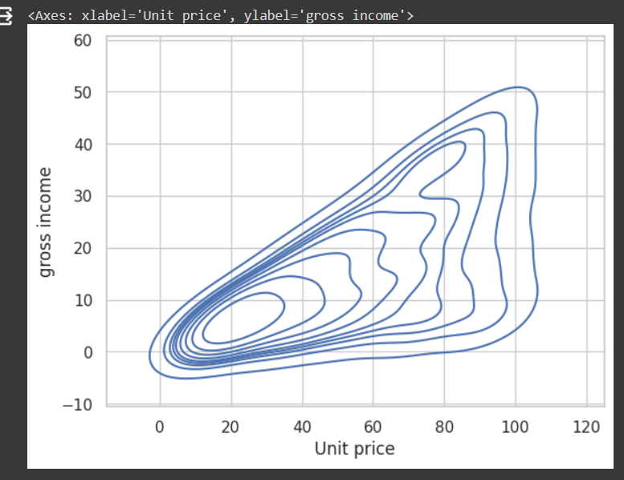
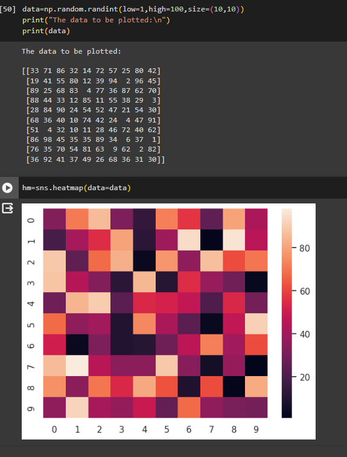

# EXNO-6-DS-DATA VISUALIZATION USING SEABORN LIBRARY

# Aim:
  To Perform Data Visualization using seaborn python library for the given datas.

# EXPLANATION:
Data visualization is the graphical representation of information and data. By using visual elements like charts, graphs, and maps, data visualization tools provide an accessible way to see and understand trends, outliers, and patterns in data.

# Algorithm:
STEP 1:Include the necessary Library.

STEP 2:Read the given Data.

STEP 3:Apply data visualization techniques to identify the patterns of the data.

STEP 4:Apply the various data visualization tools wherever necessary.

STEP 5:Include Necessary parameters in each functions.

# Coding and Output:
```
import seaborn as sns
import matplotlib.pyplot as plt

x=[1,2,3,4,5]
y=[3,6,2,7,1]

sns.lineplot(x=x,y=y)

``` 

```
sns.lineplot(x="total_bill",y="tip",data=df,hue="sex",linestyle='solid',legend="auto")


```

```
x=[1,2,3,4,5]
y1=[3,5,2,6,1]
y2=[1,6,4,3,8]
y3=[5,2,7,1,4]

sns.lineplot(x=x,y=y1)
sns.lineplot(x=x,y=y2)
sns.lineplot(x=x,y=y3)

plt.title('Multi-Line Plot')
plt.xlabel('x Label')
plt.ylabel('y Label')
```

```
sns.lineplot(x="total_bill",y="tip",data=df,hue="sex",linestyle='solid',legend="auto")
```

```
import seaborn as sns
dt=sns.load_dataset('tips')
sns.barplot(x='day',y='total_bill',hue='sex',data=dt,palette='Set1')
plt.xlabel('Day of the week')
plt.ylabel('Total Bill')
plt.title('Total Bill by Day and Gender')
```

```
plt.figure(figsize=(8,5))
sns.barplot(x='Embarked',y='Fare',data=tit,palette='rainbow')
plt.title("Fare of Passenger by Embarked Town")
```

```
plt.figure(figsize=(8,5))
sns.barplot(x='Embarked',y='Fare',data=tit,palette='rainbow',hue='Pclass')
plt.title("Fare of Passenger by Embarked Town, Divided by Class")
```

```
import seaborn as sns
tips=sns.load_dataset('tips')
sns.scatterplot(x='total_bill',y='tip',hue='sex',data=tips)
plt.xlabel('Total Bill')
plt.ylabel('Tip Amount')
plt.title('Scatter Plot of Total Bill vs. Tip Amount')
```

```
import seaborn as sns
import numpy as np
import pandas as pd
np.random.seed(1)
num_var=np.random.randn(1000)
num_var=pd.Series(num_var,name="Numerical Variable")
num_var
```

```
sns.histplot(data=num_var,kde=True)
```

```
sns.histplot(data=num_var,kde=False)
```

```
sns.histplot(data=df,x='Pclass',hue='Survived',kde=True)
```

```
import seaborn as sns
import pandas as pd
tips=sns.load_dataset('tips')
sns.boxplot(x=tips['day'],y=tips['total_bill'],hue=tips['sex'])
```

```
sns.boxplot(x="day",y="total_bill",hue="smoker",data=tips,linewidth=2,width=0.6,boxprops={"facecolor":"lightblue","edgecolor":"darkblue"},whiskerprops={"color":"black","linestyle":"--","linewidth":1.5},capprops={"color":"black","linestyle":"--","linewidth":1.5})
```

```
sns.boxplot(x='Pclass',y='Age',data=df,palette='rainbow')
plt.title("Age by Passenger Class, Titanic")

```


```
sns.violinplot(x="day",y="total_bill",hue="smoker",data=tips,linewidth=2,width=0.6,palette='Set3',inner='quartile')
plt.xlabel("Day of the week")
plt.ylabel("Total Bill")
plt.title("Violin Plot of Total Bill by Day and Smoker Status")
```


```
import seaborn as sns
sns.set(style = 'whitegrid')
tip=sns.load_dataset('tips')
sns.violinplot(x="tip",y='day',data=tip)
```

```
sns.kdeplot(data=tips,x='total_bill',hue='time',multiple='fill',linewidth=3,palette='Set2',alpha=0.8)
```

```
sns.kdeplot(data=mart,x='Unit price')
```

```
sns.kdeplot(data=mart,x='Unit price',y='gross income')
```

```
data=np.random.randint(low=1,high=100,size=(10,10))
print("The data to be plotted:\n")
print(data)

hm=sns.heatmap(data=data)
```



# Result:
Thus, all the data visualization techniques of seaborn has been implemented.
